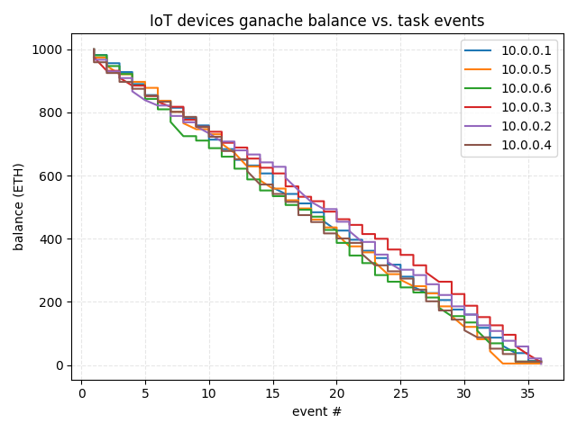
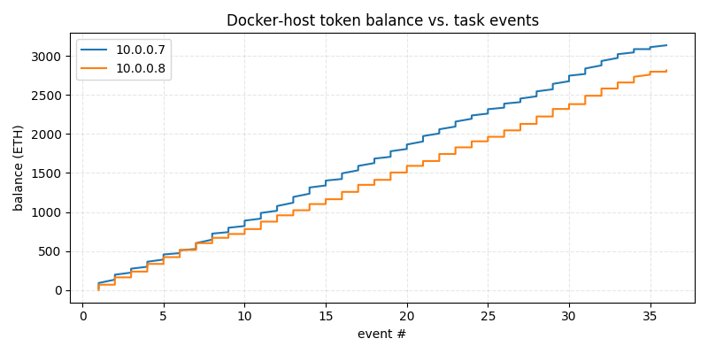

# Token Based Approach for Resource Management in IoT Edge Networks

## Project Description
This project implements a token-based resource management system for IoT Edge Networks using SDN (Software-Defined Networking) and blockchain technologies. It combines Mininet-WiFi for network emulation, Floodlight as the SDN controller, and a private blockchain using Ganache for token management.

## System Requirements
- Ubuntu 22.04 LTS
- Git
- Python 3.x

## Project Structure
```plaintext
senior_project/
├── images/                      # Visualization outputs
├── sdn-blockchain/              # Smart contract and blockchain code
│   ├── contracts/              # Solidity smart contracts
│   ├── migrations/             # Truffle migration scripts
│   └── truffle-config.js       # Truffle configuration
├── custom_topo.py              # Custom network topology definition
├── main.py                     # Main SDN controller and token logic
├── plot_balances.py           # Token balance visualization
├── stats.py                   # Request statistics tracking
├── balances.py               # Balance monitoring script
└── docker-compose.yml        # Docker services configuration
```

## Key Components
### Python Scripts
- custom_topo.py : Defines a custom network topology with 9 OVS switches in a 3x3 torus configuration, 3 WiFi access points, 6 IoT stations, and 2 Docker-based hosts
- main.py : Implements the core SDN controller logic, token management, and request routing
- plot_balances.py : Generates visualizations of token balances over time
- stats.py : Tracks and visualizes request statistics
- balances.py : Monitors and reports token balances on the blockchain
## Network Topology
The network consists of a 3x3 torus of switches, with WiFi access points and Docker hosts strategically placed for optimal coverage and resource distribution.


## Token Balance Analysis
The graphs demonstrate the token-based resource management in action:

- As IoT devices make requests, their token balances decrease
- Docker hosts accumulate tokens as they process requests
- This mechanism helps maintain fair resource allocation and prevents overutilization




## Request Management
The request counter visualization shows:

- Total number of requests over time
- Number of successful transfers using SDBlockEdge
- As IoT devices exhaust their tokens, abnormal requests are automatically rejected

## Installation

### Step 1: Prepare Installation Scripts
```bash
sudo chmod +x install.sh install2.sh
```
### Run First Installation Script
```bash
./install.sh
 ```
This script installs:
- Basic system dependencies
- Mininet
- Docker
- Floodlight Controller (Docker image)
- Ganache and Truffle (Blockchain tools)

###  Run Second Installation Script
```bash
./install2.sh
 ```
Note: During installation, you may be prompted about previous patches. Answer 'y' to all three questions if prompted.
After successful installation, the following directories should be created:
- containernet/
- mac80211_hwsim_mgmt/
- mininet-wifi/
- openflow/
- wmediumd/
- sdn-blockchain/ (for Ganache private blockchain)

## Project Structure After Installation
```plaintext
senior_project/
├── containernet/
├── mac80211_hwsim_mgmt/
├── mininet-wifi/
├── openflow/
├── wmediumd/
├── sdn-blockchain/
│   ├── build/
│   ├── contracts/
│   ├── migrations/
│   ├── test/
│   └── truffle-config.js
├── custom_topo.py
├── main.py
├── balances.py
├── install.sh
├── install2.sh
└── docker-compose.yml
 ```

## Running the Project
### 1. Start the Floodlight Controller
```bash
sudo docker compose up
 ```

### 2. Run Custom Network Topology
```bash
sudo python custom_topo.py
 ```

### 3. Run Local Blockchain
```bash
cd sdn-blockchain
ganache
 ```

### 4. Visualize the Network Topology and simulate token transfer
```bash
python main.py
 ```

### 5. Check the tokens on each balance on ganache local blockchain
```bash
python balances.py
 ```